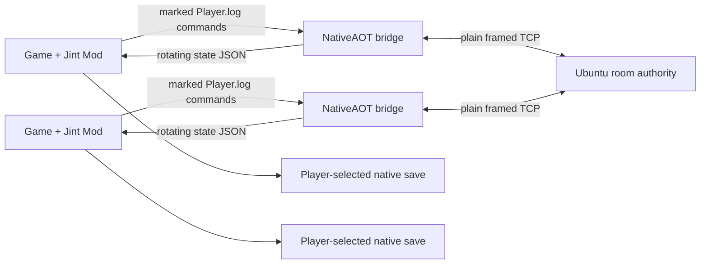

# Architecture

The project has two network paths: production public rooms through an Ubuntu authority/relay, and retained local direct Host/Join. Both use the bundled Windows bridge; neither injects a DLL into the game.

## Runtime components

- `src/GameMod/` owns Unity UI, hooks, save lifecycle, online time presentation and player/profile synchronization.
- `src/MultiplayerBridge/` contains direct TCP and the dedicated-room client adapter with bounded queues.
- `src/MultiplayerBridgeHost/` owns process lifecycle, log-command IPC, rotating state snapshots, endpoint decoding and save cryptography.
- `src/MultiplayerRoomServer/` owns public membership, clock/scene/sleep control and packet relay.
- `mod/main.ts` and `mod/i18n/` are generated runtime copies; edit `src/GameMod/` instead.

The bridge launches as the current user without registry IPC or elevation. Game-to-bridge commands are marked single-line records in Unity `Player.log`. Bridge-to-game state uses three rotating JSON snapshots so the Jint reader does not race the writer.

## Authority and synchronization

| Data | Public-room authority | Frequency/path |
| --- | --- | --- |
| Membership and authenticated peer ID | Ubuntu server | Connection lifecycle |
| Position, rotation, action, weapon, Animator layers | Owning player | 20 Hz snapshot; render-frame interpolation |
| Clothing, customization, complete profile snapshot | Owning player | Revisioned 2 s profile update; chunked when required |
| Health, stamina, money, day/time display and scene | Owning player | 0.5 s live-data update |
| Detailed day/time/offset | Each game client | Native game flow; the public server never writes a clock value |
| Room scene | Ubuntu server peer `0` | Compare-and-swap request/broadcast |
| Sleep advancement | Ubuntu server peer `0` + every client | Server approves unanimous matching requests; every client applies the same transition |
| Player save | Local player computer | Player-selected native slot; never sent to the room server as a file |

The server validates the room envelope and authenticated member identity. For public traffic it replaces player-owned IDs/names and handles scene/sleep control packets. It intentionally drops legacy `worldTime`, `serverTimeSeed`, and `serverTimeCommit` packets and never broadcasts a detailed clock. Each client therefore keeps the game's native time flow and story-driven `AddTime/AddDay` results. A unanimous sleep request—including a single member in a one-player room—is approved by the server, then every current client applies the same transition. The server does not simulate Unity physics, combat, quests or inventory.

Profile transfer is for remote appearance and player-information views. Receiving another player's complete profile does not apply that progress to the local save.

## Room lifecycle

1. The server permanently maintains `public-1`; `room.list` returns actual rooms with live population and server-defined capacity even after every player leaves.
2. `room.enter` joins the selected listed room without a password; public capacity is never supplied by a client.
3. The server remains logical peer `0`; every player receives the smallest available positive member ID. A departed member's ID is immediately reusable, including ID `1`.
4. When all public rooms are full the server creates the next numbered room. Redundant empty rooms are reclaimed while one joinable empty room is retained.
5. `room.create`/`room.join` remain available for explicit rooms and compatibility clients; the in-game local Host/Join page instead uses direct `BridgeNode` TCP.
6. Direct mode retains player-host authority and may require inbound networking; public mode never grants authority to a player.
7. No standalone heartbeat is sent. Existing public TCP frames refresh activity; five minutes without a complete client frame closes the socket and routes cleanup through `LeaveRoomAsync`, releasing membership and the reusable ID.
8. Independently, five minutes without at least 0.05 units of accumulated world-position movement or a scene change is treated as AFK, even if stationary position packets continue arriving.

Frames are a four-byte big-endian length followed by UTF-8 JSON, with a 64 KiB frame limit. The transport is plain TCP, not TLS. AES-GCM endpoint obfuscation only hides editable configuration; it does not secure packets on the wire.

## Save behavior

After entering a room, the Mod invokes the original main-menu Load Game button and lets `LoadSaveWindow` own the complete transaction. The player chooses a native slot; the Mod does not call `StartGame` or `LoadGame` itself and does not enable synchronization or saving until native loading and its callbacks settle. Automatic saves, bed saves, pause-menu controls and exit preserve the selected `GameManager.SaveName`. The bridge is network-only.

Legacy `MPOnline`/`MPActive` files are left on disk for manual recovery, but the current release does not list, read or write them. Multiplayer and single-player changes to the same player-selected native slot are visible to each other by design.

## Source assembly

UcModLauncher loads one Jint script and does not resolve TypeScript modules. `build.ps1` verifies that `src/GameMod/source-order.json` lists every `.ts` file exactly once, concatenates the files into `mod/main.ts`, checks page/component boundaries, and verifies identical translation keys across six languages.
