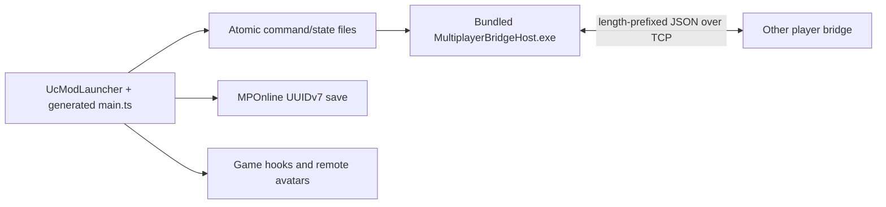

# Architecture

The released Mod is player-hosted. The host game owns authoritative room time and relays TCP packets;
every player keeps an independent online save. The experimental Ubuntu room server is a separate
project and is not used by the current client.

## Runtime flow

- `src/GameMod/` is the editable in-game source. It owns UI, hooks, online time, player/profile
  synchronization and save redirection.
- `src/MultiplayerBridge/` owns framed TCP transport and bounded queues.
- `src/MultiplayerBridgeHost/` owns process lifecycle, IPC snapshots, online-save encryption and
  the player-hosted bridge executable.
- `mod/main.ts` and `mod/i18n/` are generated runtime copies. Do not edit them directly.
- `src/MultiplayerRoomServer/` is an isolated experimental relay and has no dependency from the
  current player Mod or release ZIP.

## Synchronization ownership

| Data | Authority | Update path |
| --- | --- | --- |
| Position, rotation, actions, Animator layers | Each owning player | 20 Hz snapshots, rendered every frame |
| Clothing, customization, progress | Each owning player | Revisioned profile packets with chunking |
| Health, stamina, money and scene | Each owning player | Compact live-data packets |
| World time and day | Host Mod clock | 5 Hz authoritative anchors |
| Sleep time changes | All connected players | Host approval after unanimous matching requests |
| Online save | Local player only | UUIDv7 slot, encrypted and atomically written |

## Source assembly

UcModLauncher loads one Jint script and does not resolve TypeScript modules. `build.ps1` validates
that `src/GameMod/source-order.json` contains every `.ts` module exactly once, then concatenates the
modules into `mod/main.ts`. The build also verifies that every language has the same keys as English.
