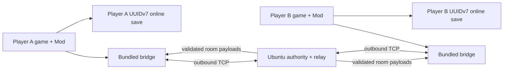

# Architecture

The production architecture uses an Ubuntu public-room relay. Every player bridge decrypts its embedded
endpoint and opens an outbound TCP connection to the server. The server owns logical peer `0`, room
membership, the shared clock, scene compare-and-swap arbitration, sleep consensus and packet routing.
Every player is an ordinary positive-ID member and keeps an independent online save.
The public UI does not expose the older direct TCP compatibility path.

## Runtime flow

- `src/GameMod/` is the editable in-game source. It owns UI, hooks, online time, player/profile
  synchronization and save redirection.
- `src/MultiplayerBridge/` owns direct framed TCP transport, the dedicated-room protocol adapter and bounded queues.
- `src/MultiplayerBridgeHost/` owns process lifecycle, IPC snapshots, online-save encryption and
  the self-contained Windows bridge executable. `PublicServerEndpoint.cs` decrypts the embedded endpoint.
- `mod/main.ts` and `mod/i18n/` are generated runtime copies. Do not edit them directly.
- `src/MultiplayerRoomServer/` is the Docker room relay. It is deployed separately and is not included in the player ZIP.

## Synchronization ownership

| Data | Authority | Update path |
| --- | --- | --- |
| Position, rotation, actions, Animator layers | Each owning player | 20 Hz snapshots, rendered every frame |
| Clothing, customization, progress | Each owning player | Revisioned profile packets with chunking |
| Health, stamina, money and scene | Each owning player | Compact live-data packets |
| World time and day | Ubuntu room server | 5 Hz authoritative anchors |
| Room scene | Ubuntu room server | Compare-and-swap requests plus authoritative broadcast |
| Sleep time changes | Ubuntu room server | Approval after unanimous matching player requests |
| Online save | Local player only | UUIDv7 slot, encrypted and atomically written |

## Room lifecycle

1. Every public button maps to a fixed room ID (`public-1`, `public-2` or `public-3`).
2. Every player sends `room.enter`; the server atomically joins an existing room or creates it when empty.
3. The server remains logical authority peer `0`; every player receives a positive ordinary-member ID.
4. The server overwrites player-owned packet IDs with the authenticated connection ID, preventing member impersonation.
5. `room.send` payloads are forwarded without the server parsing player state or save data.
6. A disconnect removes only that player. Public rooms persist until an administrator closes them or the service restarts.

The endpoint is an AES-GCM ciphertext constant in the NativeAOT bridge, not plaintext configuration. Because the client also contains the key derivation material, this is static obfuscation and tamper resistance, not a secret that can withstand binary analysis.

## Source assembly

UcModLauncher loads one Jint script and does not resolve TypeScript modules. `build.ps1` validates
that `src/GameMod/source-order.json` contains every `.ts` module exactly once, then concatenates the
modules into `mod/main.ts`. The build also verifies that every language has the same keys as English.
