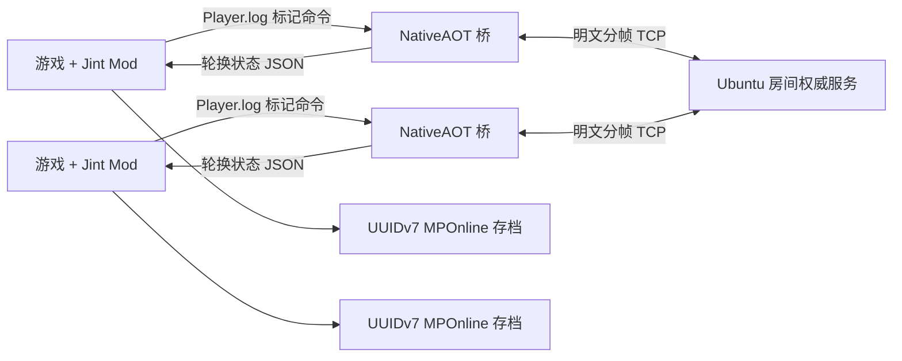
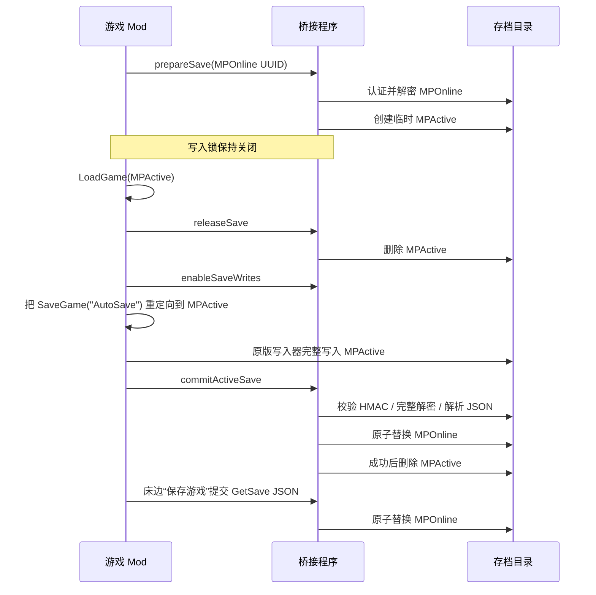

# 架构说明

项目包含两条网络路径：生产使用 Ubuntu 权威/中继的公开房间，同时保留本地直连“建立/加入”。两者都使用随包 Windows 桥接程序，不向游戏注入 DLL。

## 运行组件

- `src/GameMod/`：Unity UI、Hook、存档生命周期、线上时间显示和玩家/资料同步。
- `src/MultiplayerBridge/`：本地直连 TCP、独立房间客户端适配和有界队列。
- `src/MultiplayerBridgeHost/`：进程生命周期、日志命令 IPC、轮换状态快照、端点解码和存档加密。
- `src/MultiplayerRoomServer/`：公开房间成员、时钟/场景/睡眠控制和数据转发。
- `mod/main.ts` 与 `mod/i18n/` 是生成的运行副本，应修改 `src/GameMod/`。

桥接程序以当前普通用户启动，不使用注册表 IPC，也不申请提权。游戏到桥接的命令写成 Unity `Player.log` 中的单行专用标记；桥接到游戏使用三个轮换 JSON 快照，避免 Jint 读取与写入竞争。

## 权威与同步

| 数据 | 公开房间权威来源 | 频率/路径 |
| --- | --- | --- |
| 成员与认证玩家 ID | Ubuntu 服务器 | 连接生命周期 |
| 位置、旋转、动作、武器、Animator 层 | 玩家本人 | 20 Hz 快照；逐渲染帧插值 |
| 衣服、捏脸、完整资料快照 | 玩家本人 | 每 2 秒修订资料；必要时分片 |
| 生命、耐力、金钱、日期/时间显示和场景 | 玩家本人 | 每 0.5 秒实时资料 |
| 房间时段 | Ubuntu 服务器 Peer `0` | 5 Hz 锚点；新房/空房从早晨开始；现实 3,600 秒为一个完整周期 |
| 房间场景 | Ubuntu 服务器 Peer `0` | 比较交换请求/广播 |
| 睡眠推进 | Ubuntu 服务器 Peer `0` | 全员相同请求后由服务器直接推进并批准 |
| 线上存档 | 玩家本机 | UUIDv7 文件；不会作为文件发送给服务器 |

服务器校验房间信封与已经认证的成员身份。公开流量中，它会替换玩家声明的 ID/名称、拒绝玩家时间权威，并处理时间/场景/睡眠控制包。公开房间只维护相对 `roomCycle` 和时段；任何玩家的绝对剧情日期都不会成为时钟输入，也不会应用到其他玩家。新成员只以当前周期建立基线，不补算加入前经历的天数。原版四个时段均分配置的周期长度；全员睡眠（单人房间即该玩家本人）达成时，服务器先推进房间时段再广播批准。服务器不模拟 Unity 物理、战斗、任务或背包。

完整资料传输用于远端外观和玩家信息页面，不会把其他玩家的进度应用到本机存档。

## 房间生命周期

1. 服务器永久维持 `public-1`；即使所有玩家离开，`room.list` 仍返回该真实房间、实时人数和服务器指定的容量。
2. `room.enter` 无密码加入列表中的房间；客户端不能指定公开房间容量。
3. 服务器始终是逻辑 Peer `0`；玩家获得当前最小的空闲正数成员 ID，成员离开后包括 `1` 在内的编号立即可复用。
4. 全部公开房间满员后，服务器建立下一个编号房间；多余空房间会被回收，同时保留一个可加入的空房间。
5. `room.create`/`room.join` 仍供显式房间和兼容客户端使用；游戏内本地“建立/加入”使用直连 `BridgeNode` TCP。
6. 本地直连仍由玩家房主权威控制，并可能需要入站网络配置；公开模式不会把权威交给玩家。
7. 客户端不单独发送心跳，现有公开 TCP 数据帧负责刷新活动时间；连续 5 分钟没有收到完整客户端帧时关闭套接字，并统一通过 `LeaveRoomAsync` 释放成员和可复用 ID。
8. 独立判断挂机：即使相同坐标的位置包持续到达，连续 5 分钟没有累计至少 0.05 单位的世界坐标位移且没有切换场景，也会断开并释放成员。

每帧由 4 字节大端长度和 UTF-8 JSON 构成，最大 64 KiB。传输是明文 TCP，不是 TLS。AES-GCM 端点混淆只隐藏可编辑配置，不会加密网络数据包。

## 存档事务

正常情况下只有 `MPOnline_<UUIDv7>.save` 持久存在。之所以短暂生成 `MPActive`，只是因为游戏无法读取 Mod 的认证外层容器。准备和加载期间，游戏脚本与桥接程序都会拒绝写入；加载失败时正式线上档逐字节保持不变。

线上自动保存会以隔离的 `MPActive` 名称执行完整原版方法，保留退出和切换流程。写入结束后，桥接程序校验游戏 HMAC、完整解密并解析 JSON，从磁盘复验新外层容器，再原子替换 `MPOnline`，最后删除 `MPActive`。床边手动保存仍作为直接快照提交的备用入口。线上流程不会读取或写入单机 `AutoSave.save`。

暂停菜单退出保持原版行为；若原版退出流程调用 AutoSave，则走相同的校验两阶段提交。桥接进程结束时会重试可写阶段的有效 `MPActive`，半完成或无效文件不能替换正式档。

## 源码合并

UcModLauncher 只加载一个 Jint 脚本，不能解析 TypeScript 模块。`build.ps1` 会检查 `src/GameMod/source-order.json` 是否恰好包含每个 `.ts` 文件一次，合并生成 `mod/main.ts`，校验页面/组件边界，并检查六种语言的翻译键完全一致。
