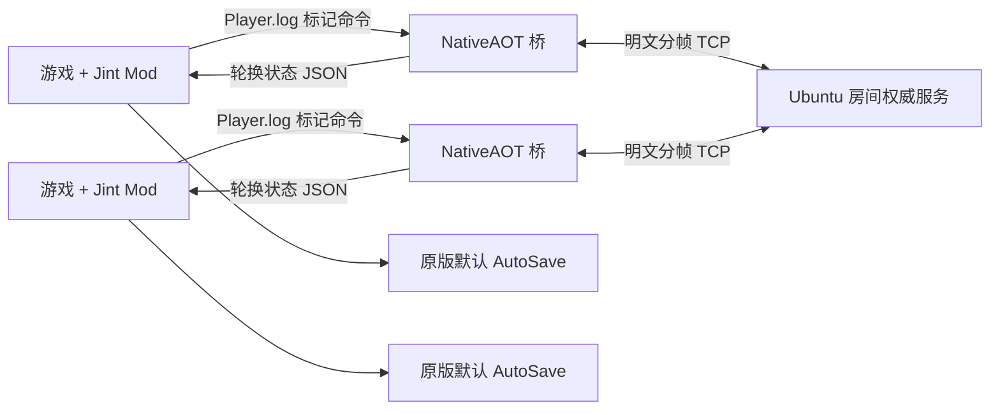

# 架构说明

项目包含两条网络路径：生产使用 Ubuntu 权威/中继的公开房间，同时保留本地直连“建立/加入”。两者都使用随包 Windows 桥接程序，不向游戏注入 DLL。

## 运行组件

- `src/GameMod/`：Unity UI、Hook、存档生命周期、线上时间显示和玩家/资料同步。
- `src/MultiplayerBridge/`：本地直连 TCP、独立房间客户端适配和有界队列。
- `src/MultiplayerBridgeHost/`：进程生命周期、日志命令 IPC、轮换状态快照和端点解码；不接触存档文件。
- `src/MultiplayerRoomServer/`：公开房间成员、场景/睡眠控制和数据转发。
- `mod/main.ts` 与 `mod/i18n/` 是生成的运行副本，应修改 `src/GameMod/`。

桥接程序以当前普通用户启动，不使用注册表 IPC，也不申请提权。每个游戏实例使用由 Unity 常驻对象保存的独立通道、互斥锁、IPC 标记和状态快照；启动通道通过带短时戳的 `Player.log` 标记交给桥接程序，不调用 Jint 沙箱禁止的进程 API。同机运行多个游戏时不会互相消费房间命令。游戏到桥接的命令写成 Unity `Player.log` 中的单行专用标记；桥接到游戏使用三个轮换 JSON 快照，避免 Jint 读取与写入竞争。

## 权威与同步

| 数据 | 公开房间权威来源 | 频率/路径 |
| --- | --- | --- |
| 成员与认证玩家 ID | Ubuntu 服务器 | 连接生命周期 |
| 位置、旋转、动作、武器、Animator 层 | 玩家本人 | 20 Hz 快照；逐渲染帧插值 |
| 衣服、捏脸、资料统计 | 玩家本人 | 每 2 秒修订资料；必要时分片 |
| 生命、耐力、金钱、日期/时间显示和场景 | 玩家本人 | 每 0.5 秒实时资料 |
| 房间场景 | Ubuntu 服务器 Peer `0` | 比较交换请求/广播 |
| 睡眠批准 | Ubuntu 服务器 Peer `0` | 全部真实玩家提出相同请求后批准；客户端执行原版床事务 |
| 玩家存档 | 玩家本机 | 原版默认 `AutoSave`；不会作为文件发送给服务器 |

服务器校验房间信封与认证成员身份，用连接身份覆盖客户端自报 ID/名称。普通玩家只能发送白名单内的自身状态、实时资料、资料分片以及睡眠/场景请求，不能伪造 `welcome`、名单、离开、服务器场景或睡眠批准。旧 `worldTime` 包直接丢弃。服务器不计算详细钟点，也不模拟 Unity 物理、战斗、任务或背包。

资料传输只包含远端外观、实时状态和聚合进度数量；不会发送完整剧情、联系人或把其他玩家进度应用到本机存档。

## 房间生命周期

1. 服务器永久维持 `public-1`；即使所有玩家离开，`room.list` 仍返回该真实房间、实时人数和服务器指定的容量。
2. `room.enter` 无密码加入列表中的房间；客户端不能指定公开房间容量。
3. 服务器构建时只嵌入独立的 `server/version.json`，分别维护 `serverVersion` 和 `requiredModVersion`，不再读取玩家包的 `mod/info.json`。`room.list` 公布服务器版本和所需 Mod 版本，支持版本握手的客户端在进入时提交 `modVersion`；不一致返回业务码 `2012` 和 HTTP 语义状态 `426`，Mod 在读档前弹出更新提示。
4. 服务器始终是逻辑 Peer `0`；玩家获得当前最小的空闲正数成员 ID，成员离开后包括 `1` 在内的编号立即可复用。
5. 全部公开房间满员后，服务器建立下一个编号房间；多余空房间会被回收，同时保留一个可加入的空房间。
6. `room.create`/`room.join` 仍供显式房间和兼容客户端使用；游戏内本地“建立/加入”使用直连 `BridgeNode` TCP。
7. 本地直连仍由玩家房主权威控制，并可能需要入站网络配置；公开模式不会把权威交给玩家。
8. 客户端不单独发送心跳，现有公开 TCP 数据帧负责刷新活动时间；连续 5 分钟没有收到完整客户端帧时关闭套接字，并统一通过 `LeaveRoomAsync` 释放成员和可复用 ID。
9. 独立判断挂机：即使相同坐标的位置包持续到达，连续 5 分钟没有累计至少 0.05 单位的世界坐标位移且没有切换场景，也会断开并释放成员。

每帧由 4 字节大端长度和 UTF-8 JSON 构成，最大 64 KiB。传输是明文 TCP，不是 TLS。AES-GCM 端点混淆只隐藏可编辑配置，不会加密网络数据包。

## 存档行为

进入房间后，Mod 在同一帧调用原版读取初始化器、通过 Unity 消息调用游戏真正执行读档的 `LoadSaveWindow.ExecuteLoad("AutoSave")`，然后在 Canvas 渲染前立即隐藏选择框。新版游戏的 `Load` 只会打开确认框；等待已经隐藏的确认框会导致读档永远不开始。完整事务仍由原版读取器独占，Mod 不自行调用 `StartGame` 或 `GameManager.LoadGame`；回调稳定前不开放同步或保存。自动保存、床边保存、暂停菜单和退出均沿用原版设置的 `GameManager.SaveName`。桥接程序只负责网络。

旧版本创建的 `MPOnline`/`MPActive` 不会自动删除，便于人工恢复，但当前版本不会列出、读取或写入。联机与单机对原版默认槽位的修改会彼此可见，这是采用原版存档的预期行为。

## 源码合并

UcModLauncher 只加载一个 Jint 脚本，不能解析 TypeScript 模块。`tools/Build-Mod.ps1` 会检查 `src/GameMod/source-order.json` 是否恰好包含每个 `.ts` 文件一次，合并生成 `mod/main.ts`，校验页面/组件边界，并检查六种语言的翻译键完全一致。
