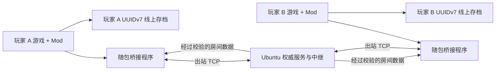

# 架构说明

生产架构使用 Ubuntu 公开房间中继。每名玩家的桥接程序先解密内置端点，再向服务器建立出站
TCP 连接。服务器持有逻辑 Peer `0`、房间成员、统一时钟、场景比较交换裁决、睡眠共识与数据转发；
所有玩家都是正数 ID 的普通成员，并分别保存自己的线上存档。公开 UI 不再显示旧版玩家直连兼容入口。

## 运行流程

- `src/GameMod/` 是可编辑游戏脚本，负责 UI、Hook、线上时间、玩家/资料同步和存档重定向。
- `src/MultiplayerBridge/` 负责直连 TCP、独立房间协议适配和有界消息队列。
- `src/MultiplayerBridgeHost/` 负责进程生命周期、IPC 状态快照、线上存档加密和自包含 Windows 桥接程序；`PublicServerEndpoint.cs` 解密内置端点。
- `mod/main.ts` 与 `mod/i18n/` 是生成的运行副本，不应直接编辑。
- `src/MultiplayerRoomServer/` 是单独部署的 Docker 房间中继，不进入玩家发布 ZIP。

## 同步数据归属

| 数据 | 权威来源 | 更新方式 |
| --- | --- | --- |
| 位置、旋转、动作、Animator 层 | 各玩家本人 | 20 Hz 快照，逐渲染帧显示 |
| 衣服、捏脸、进度 | 各玩家本人 | 带修订号的完整资料包，过大时分片 |
| 生命、耐力、金钱和场景 | 各玩家本人 | 小型实时资料包 |
| 世界时间和日期 | Ubuntu 房间服务器 | 5 Hz 权威锚点 |
| 房间场景 | Ubuntu 房间服务器 | 比较交换请求与权威广播 |
| 睡眠导致的时间变化 | Ubuntu 房间服务器 | 收到全员相同请求后批准 |
| 线上存档 | 本地玩家 | UUIDv7 文件、加密并原子写入 |

## 房间生命周期

1. 三个公开按钮分别映射固定房间 ID：`public-1`、`public-2`、`public-3`。
2. 每名玩家发送 `room.enter`；服务器原子地加入现有房间，或在房间为空时创建。
3. 服务器始终是逻辑权威 Peer `0`；每名玩家只获得正数普通成员 ID。
4. 服务器用已经认证的连接 ID 覆盖玩家数据包中的 ownerId，普通成员不能冒充其他玩家。
5. 服务器只解析控制信封、强制成员身份并协调时间/场景/睡眠，不解释存档资料字段，也不运行游戏模拟。
6. 玩家断开只移除自己；公开房间持续存在，直到管理员关闭或服务重启。

端点作为 AES-GCM 密文常量存在 NativeAOT 桥接程序内，不以明文配置发布。客户端同时包含密钥派生材料，所以这是静态隐藏和防止随手篡改，不是能够抵抗二进制分析的秘密管理。

## 源码合并

UcModLauncher 只加载一个 Jint 脚本，不能解析 TypeScript 模块。`build.ps1` 会先检查
`src/GameMod/source-order.json` 是否恰好包含每个 `.ts` 模块一次，再合并生成 `mod/main.ts`；
同时检查所有语言包的键是否与英语一致。
