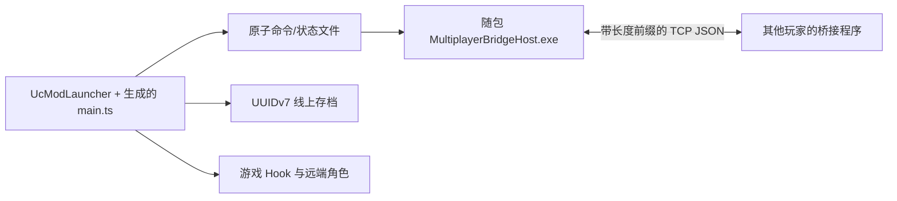

# 架构说明

当前发布版使用玩家主机模式：房主游戏维护权威房间时间并转发 TCP 数据，每名玩家分别保存自己的
线上存档。实验性 Ubuntu 房间服务器是独立项目，当前客户端不会使用它。

## 运行流程

- `src/GameMod/` 是可编辑游戏脚本，负责 UI、Hook、线上时间、玩家/资料同步和存档重定向。
- `src/MultiplayerBridge/` 负责 TCP 帧协议和有界消息队列。
- `src/MultiplayerBridgeHost/` 负责进程生命周期、IPC 状态快照、线上存档加密和玩家桥接程序。
- `mod/main.ts` 与 `mod/i18n/` 是生成的运行副本，不应直接编辑。
- `src/MultiplayerRoomServer/` 是隔离的实验性转发服务，当前玩家 Mod 和发布 ZIP 都不依赖它。

## 同步数据归属

| 数据 | 权威来源 | 更新方式 |
| --- | --- | --- |
| 位置、旋转、动作、Animator 层 | 各玩家本人 | 20 Hz 快照，逐渲染帧显示 |
| 衣服、捏脸、进度 | 各玩家本人 | 带修订号的完整资料包，过大时分片 |
| 生命、耐力、金钱和场景 | 各玩家本人 | 小型实时资料包 |
| 世界时间和日期 | 房主 Mod 时钟 | 5 Hz 权威锚点 |
| 睡眠导致的时间变化 | 所有在线玩家 | 相同请求全员通过后由房主批准 |
| 线上存档 | 本地玩家 | UUIDv7 文件、加密并原子写入 |

## 源码合并

UcModLauncher 只加载一个 Jint 脚本，不能解析 TypeScript 模块。`build.ps1` 会先检查
`src/GameMod/source-order.json` 是否恰好包含每个 `.ts` 模块一次，再合并生成 `mod/main.ts`；
同时检查所有语言包的键是否与英语一致。
